# strands-omnivoice

[](LICENSE)
[](pyproject.toml)
[](https://strandsagents.com)
[](https://github.com/k2-fsa/OmniVoice)

[![Awesome Strands Agents](https://img.shields.io/badge/Awesome-Strands%20Agents-00FF77?style=flat-square&logo=data:image/svg+xml;base64,PHN2ZyB3aWR0aD0iMjkwIiBoZWlnaHQ9IjQ2MyIgdmlld0JveD0iMCAwIDI5MCA0NjMiIGZpbGw9Im5vbmUiIHhtbG5zPSJodHRwOi8vd3d3LnczLm9yZy8yMDAwL3N2ZyI+CjxwYXRoIGQ9Ik05Ny4yOTAyIDUyLjc4ODRDODUuMDY3NCA0OS4xNjY3IDcyLjIyMzQgNTYuMTM4OSA2OC42MDE3IDY4LjM2MTZDNjQuOTgwMSA4MC41ODQzIDcxLjk1MjQgOTMuNDI4MyA4NC4xNzQ5IDk3LjA1MDFMMjM1LjExNyAxMzkuNzc1QzI0NS4yMjMgMTQyLjc2OSAyNDYuMzU3IDE1Ni42MjggMjM2Ljg3NCAxNjEuMjI2TDMyLjU0NiAyNjAuMjkxQy0xNC45NDM5IDI4My4zMTYgLTkuMTYxMDcgMzUyLjc0IDQxLjQ4MzUgMzY3LjU5MUwxODkuNTUxIDQxMS4wMDlMMTkwLjEyNSA0MTEuMTY5QzIwMi4xODMgNDE0LjM3NiAyMTQuNjY1IDQwNy4zOTYgMjE4LjE5NiAzOTUuMzU1QzIyMS43ODQgMzgzLjEyMiAyMTQuNzc0IDM3MC4yOTYgMjAyLjU0MSAzNjYuNzA5TDU0LjQ3MzggMzIzLjI5MUM0NC4zNDQ3IDMyMC4zMjEgNDMuMTg3OSAzMDYuNDM2IDUyLjY4NTcgMzAxLjgzMUwyNTcuMDE0IDIwMi43NjZDMzA0LjQzMiAxNzkuNzc2IDI5OC43NTggMTEwLjQ4MyAyNDguMjMzIDk1LjUxMkw5Ny4yOTAyIDUyLjc4ODRaIiBmaWxsPSIjRkZGRkZGIi8+CjxwYXRoIGQ9Ik0yNTkuMTQ3IDAuOTgxODEyQzI3MS4zODkgLTIuNTc0OTggMjg0LjE5NyA0LjQ2NTcxIDI4Ny43NTQgMTYuNzA3NEMyOTEuMzExIDI4Ljk0OTIgMjg0LjI3IDQxLjc1NyAyNzIuMDI4IDQ1LjMxMzhMNzEuMTcyNyAxMDMuNjcxQzQwLjcxNDIgMTEyLjUyMSAzNy4xOTc2IDE1NC4yNjIgNjUuNzQ1OSAxNjguMDgzTDI0MS4zNDMgMjUzLjA5M0MzMDcuODcyIDI4NS4zMDIgMjk5Ljc5NCAzODIuNTQ2IDIyOC44NjIgNDAzLjMzNkwzMC40MDQxIDQ2MS41MDJDMTguMTcwNyA0NjUuMDg4IDUuMzQ3MDggNDU4LjA3OCAxLjc2MTUzIDQ0NS44NDRDLTEuODIzOSA0MzMuNjExIDUuMTg2MzcgNDIwLjc4NyAxNy40MTk3IDQxNy4yMDJMMjE1Ljg3OCAzNTkuMDM1QzI0Ni4yNzcgMzUwLjEyNSAyNDkuNzM5IDMwOC40NDkgMjIxLjIyNiAyOTQuNjQ1TDQ1LjYyOTcgMjA5LjYzNUMtMjAuOTgzNCAxNzcuMzg2IC0xMi43NzcyIDc5Ljk4OTMgNTguMjkyOCA1OS4zNDAyTDI1OS4xNDcgMC45ODE4MTJaIiBmaWxsPSIjRkZGRkZGIi8+Cjwvc3ZnPgo=&logoColor=white)](https://github.com/cagataycali/awesome-strands-agents)

<p align="center">
  
</p>

**Multilingual zero-shot TTS toolkit for [Strands Agents](https://strandsagents.com) — 600+ languages, voice cloning, and voice design as agent tools.**

Wraps [k2-fsa/OmniVoice](https://github.com/k2-fsa/OmniVoice) — a state-of-the-art diffusion-language-model TTS that supports 600+ languages with RTF as low as 0.025 — as a clean set of `@tool` functions that any Strands `Agent` can call.

---

## ✨ Features

- **600+ languages** — broadest zero-shot TTS coverage available
- **Voice cloning** — clone any speaker from 3–10s of reference audio
- **Voice design** — describe the speaker via attributes (`female, british accent, whisper`)
- **Auto voice** — let the model pick a voice
- **Built-in ASR** — transcribe reference audio with the bundled Whisper model
- **Batch synthesis** — generate many WAVs in one call, sharing a loaded model
- **Inline tags** — `[laughter]`, `[sigh]`, pinyin (`ZHE2`), CMU phonemes (`[B EY1 S]`)
- **Apple Silicon + CUDA + CPU** — auto-device with `STRANDS_OMNIVOICE_DEVICE` override
- **Singleton loader** — every tool shares one cached checkpoint, no reloads

---

## 📦 Install

```bash
pip install strands-omnivoice
```

That installs `strands-omnivoice` plus its `omnivoice>=0.1.5` runtime. Pick a PyTorch flavour matching your hardware:

```bash
# NVIDIA CUDA (Linux/Windows)
pip install torch==2.8.0+cu128 torchaudio==2.8.0+cu128 --extra-index-url https://download.pytorch.org/whl/cu128

# Apple Silicon (MPS)
pip install torch==2.8.0 torchaudio==2.8.0
```

### Developer setup

```bash
git clone https://github.com/cagataycali/strands-omnivoice && cd strands-omnivoice
python -m venv .venv && source .venv/bin/activate
pip install -e ".[dev]"
pytest -q
```

---

## 🚀 Quick Start

```python
from strands import Agent
from strands_omnivoice import (
    omnivoice_tts, omnivoice_clone, omnivoice_design,
    omnivoice_sysinfo, audio_play,
)

agent = Agent(tools=[
    omnivoice_tts, omnivoice_clone, omnivoice_design,
    omnivoice_sysinfo, audio_play,
])

# Auto voice
agent("Synthesize 'Hello world' to /tmp/hello.wav and play it.")

# Voice cloning
agent("Clone the speaker in /tmp/ref.wav and say 'Bonjour le monde' to /tmp/fr.wav.")

# Voice design
agent("Make a british female elderly whisper saying 'Once upon a time' to /tmp/story.wav.")
```

---

## 🧰 Tools

| Tool | Purpose |
|---|---|
| **`omnivoice_tts`** | Auto-voice synthesis — text → WAV |
| **`omnivoice_clone`** | Voice cloning from a 3–10 s reference clip |
| **`omnivoice_design`** | Voice design via attributes (gender, age, pitch, accent, dialect) |
| **`omnivoice_batch`** | Multi-item synthesis sharing a single loaded model |
| **`omnivoice_transcribe`** | ASR via OmniVoice's bundled Whisper model |
| **`omnivoice_load_model`** | Pre-warm / reload the model |
| **`omnivoice_unload_model`** | Drop cached weights and free GPU memory |
| **`omnivoice_download_model`** | Snapshot-download the checkpoint without loading |
| **`omnivoice_sysinfo`** | Device, dtype, OmniVoice version, loaded-state diagnostics |
| **`omnivoice_list_languages`** | Browse the 600+ supported languages |
| **`audio_probe`** | Inspect any audio file (duration / SR / channels / format) |
| **`audio_play`** | Play a WAV via host's default player (afplay/aplay/paplay/ffplay) |
| **`omnivoice_demo_serve`** | Launch the upstream Gradio web UI as a background process |

All tools return the standard Strands tool result shape — they compose freely inside `Agent(tools=[...])`.

---

## 🎛️ Voice Design — Attribute Reference

`instruct=` accepts a comma-separated list of attributes. Categories below are mutually exclusive within each row; combine across rows freely.

| Category | Values |
|---|---|
| **Gender** | `male`, `female` |
| **Age** | `child`, `teenager`, `young adult`, `middle-aged`, `elderly` |
| **Pitch** | `very low pitch`, `low pitch`, `moderate pitch`, `high pitch`, `very high pitch` |
| **Style** | `whisper` |
| **English accent** *(EN text only)* | `american`, `british`, `australian`, `canadian`, `indian`, `chinese`, `korean`, `portuguese`, `russian`, `japanese` accent |
| **Chinese dialect** *(ZH text only)* | `四川话`, `陕西话`, `东北话`, `云南话`, `河南话`, ... |

Examples:

```python
"female, young adult, high pitch, british accent"
"male, elderly, low pitch, whisper"
"女, 青年, 四川话"
```

See the [upstream voice-design docs](https://github.com/k2-fsa/OmniVoice/blob/master/docs/voice-design.md) for the full table.

---

## 🔊 Inline Tags & Pronunciation Control

```python
agent("""omnivoice_tts text="[laughter] You really got me." output="/tmp/laugh.wav" """)

# Chinese — pinyin pronunciation override
agent("""omnivoice_tts text="这批货物打ZHE2出售。" output="/tmp/pinyin.wav" """)

# English — CMU phoneme override
agent("""omnivoice_tts text="He plays the [B EY1 S] guitar." output="/tmp/cmu.wav" """)
```

Supported tags: `[laughter]`, `[sigh]`, `[confirmation-en]`, `[question-en]`, `[question-ah/oh/ei/yi]`, `[surprise-ah/oh/wa/yo]`, `[dissatisfaction-hnn]`.

---

## ⚙️ Configuration

Environment variables override defaults:

| Var | Default | Description |
|---|---|---|
| `STRANDS_OMNIVOICE_MODEL` | `k2-fsa/OmniVoice` | HF repo or local checkpoint path |
| `STRANDS_OMNIVOICE_DEVICE` | auto (cuda → mps → cpu) | Force device |
| `STRANDS_OMNIVOICE_DTYPE` | auto | `float16`, `float32`, `bfloat16` |

Or pass per-call via `model_id=` / `device=` arguments to any tool.

---

## 🧪 Testing the Agent

```bash
python agent.py "Show sysinfo, then synthesize 'Привет мир' to /tmp/ru.wav and play it."
```

Without args, `agent.py` lists every registered tool.

---

## 🏗️ Architecture

```
strands_omnivoice/
├── __init__.py           # exports: 13 tools + loader API
├── _common.py            # ToolResult builders (ok/err) + path helpers
├── _loader.py            # singleton OmniVoice loader (thread-safe)
└── tools/
    ├── tts.py            # auto-voice synthesis
    ├── clone.py          # voice cloning
    ├── design.py         # voice design (attributes)
    ├── batch.py          # multi-item generation
    ├── transcribe.py     # ASR
    ├── model_lifecycle.py  # load / unload / download
    ├── info.py           # sysinfo + list_languages
    ├── audio_utils.py    # probe + play
    └── demo_server.py    # Gradio UI launcher
```

The loader caches one model per `(model_id, device)` key — every tool gets the same instance, so a workflow that calls `omnivoice_clone` then `omnivoice_design` only loads weights once.

---

## 🤝 Acknowledgments

- [k2-fsa/OmniVoice](https://github.com/k2-fsa/OmniVoice) — the upstream model. Massive credit to Han Zhu and the k2-fsa team.
- [Strands Agents](https://github.com/strands-agents/sdk-python) — the agent framework.
- [strands-cosmos](https://github.com/cagataycali/strands-cosmos) — sister project that inspired this scaffold.

---

## 📄 License

Apache 2.0 — same as upstream OmniVoice. See [LICENSE](LICENSE).

> **Disclaimer**: as with the upstream model, you are strictly prohibited from using this for unauthorized voice cloning, impersonation, fraud, or any illegal/unethical activity. Use responsibly.
