---
hide:
  - navigation
  - toc
---

<div class="so-hero" markdown>
<div class="so-hero-row" markdown>
<div class="so-hero-text" markdown>

# Strands OmniVoice

<p class="tagline">Give your agent a voice — in 600+ languages, with zero training data.</p>

<a href="getting-started/quickstart/" class="so-cta">⚡ Quickstart</a>
<a href="https://github.com/cagataycali/strands-omnivoice" class="so-cta-secondary">★ GitHub</a>

</div>
<div class="so-hero-art">
  
</div>
</div>

<div class="so-stats" markdown>
<div class="so-stat"><span class="v">600+</span><span class="k">Languages</span></div>
<div class="so-stat"><span class="v">13</span><span class="k">Tools</span></div>
<div class="so-stat"><span class="v">3</span><span class="k">Voice modes</span></div>
<div class="so-stat"><span class="v">0.025</span><span class="k">RTF</span></div>
</div>

</div>

## Hear it ▶

One click on any sample below to play. All audio was generated by `strands-omnivoice` itself — code lives next to each card.

### Auto voice — the simplest path

```python
from strands_omnivoice import omnivoice_tts

omnivoice_tts(
    text="Hello world, welcome to Strands OmniVoice.",
    output="/tmp/hello.wav",
)
```

<div class="so-audio"
     data-src="assets/audio/hello_auto.mp3"
     data-label="hello_auto"
     data-tag="auto · english"
     data-text='"Hello world, welcome to Strands OmniVoice — multilingual zero-shot text to speech."'
     data-duration="4.95"></div>

### Voice design — describe the speaker

```python
from strands_omnivoice import omnivoice_design

omnivoice_design(
    text="Once upon a time, in a land far far away.",
    instruct="female, elderly, low pitch, british accent",
    output="/tmp/story.wav",
)
```

<div class="so-audio"
     data-src="assets/audio/design_uk_elderly.mp3"
     data-label="british elderly female"
     data-tag="design"
     data-text='"Once upon a time, in a land far far away, there lived a wise old story-teller."'></div>

<div class="so-audio"
     data-src="assets/audio/design_us_male.mp3"
     data-label="american middle-aged male"
     data-tag="design"
     data-text='"Houston, we have a problem. Repeat — Houston, we have a problem."'></div>

<div class="so-audio"
     data-src="assets/audio/design_whisper.mp3"
     data-label="young female · whisper"
     data-tag="design · whisper"
     data-text='"And then, when no one was watching, everything went silent."'></div>

<div class="so-audio"
     data-src="assets/audio/design_indian.mp3"
     data-label="young male · indian accent"
     data-tag="design"
     data-text='"Welcome, my friend. Today I will tell you about the wonders of the universe."'></div>

### Voice cloning — clone any speaker

```python
from strands_omnivoice import omnivoice_clone

omnivoice_clone(
    text="This is the cloned voice speaking different words.",
    ref_audio="/tmp/hello.wav",        # → reference clip
    output="/tmp/cloned.wav",
)
```

<div class="so-audio"
     data-src="assets/audio/clone_demo.mp3"
     data-label="voice clone (ref = hello_auto)"
     data-tag="clone"
     data-text='"This is the cloned voice speaking different words but in the same style."'></div>

### Multilingual — same code, any language

```python
omnivoice_tts(text="...", language="Japanese", output="ja.wav")
```

<div class="so-audio" data-src="assets/audio/lang_en.mp3" data-label="🇬🇧 English" data-tag="lang"
     data-text='"Hello, how are you today? It is a beautiful morning."'></div>
<div class="so-audio" data-src="assets/audio/lang_es.mp3" data-label="🇪🇸 Spanish" data-tag="lang"
     data-text='"Hola, ¿cómo estás hoy? Es una mañana hermosa."'></div>
<div class="so-audio" data-src="assets/audio/lang_fr.mp3" data-label="🇫🇷 French" data-tag="lang"
     data-text="&quot;Bonjour, comment allez-vous aujourd'hui ? C'est une belle matinée ensoleillée.&quot;"></div>
<div class="so-audio" data-src="assets/audio/lang_de.mp3" data-label="🇩🇪 German" data-tag="lang"
     data-text='"Hallo, wie geht es Ihnen heute? Es ist ein wunderschöner Morgen."'></div>
<div class="so-audio" data-src="assets/audio/lang_ja.mp3" data-label="🇯🇵 Japanese" data-tag="lang"
     data-text='"こんにちは、お元気ですか。今朝はとても素敵な朝です。"'></div>
<div class="so-audio" data-src="assets/audio/lang_zh.mp3" data-label="🇨🇳 Chinese (Mandarin)" data-tag="lang"
     data-text='"你好，今天过得怎么样？今早天气真好。"'></div>
<div class="so-audio" data-src="assets/audio/lang_ar.mp3" data-label="🇸🇦 Arabic" data-tag="lang"
     data-text='"مرحباً، كيف حالك اليوم؟ إنه صباح جميل."'></div>

### Inline tags — `[laughter]` `[sigh]` and more

```python
omnivoice_tts(text="[laughter] You really got me!", output="/tmp/laugh.wav")
```

<div class="so-audio"
     data-src="assets/audio/tag_laughter.mp3"
     data-label="[laughter] tag"
     data-tag="tags"
     data-text='"[laughter] You really got me with that one! I didn’t see it coming."'></div>

<div class="so-audio"
     data-src="assets/audio/tag_sigh.mp3"
     data-label="[sigh] tag"
     data-tag="tags"
     data-text='"[sigh] Another long day at the office."'></div>

---

## What you get

<div class="so-cards" markdown>

<div class="so-card" markdown>

### 600+ languages
The broadest zero-shot TTS coverage available. Same `omnivoice_tts` call, any language.
</div>

<div class="so-card" markdown>

### Voice cloning
Clone any speaker from a 3–10s reference clip. Whisper-powered auto-transcription.
</div>

<div class="so-card" markdown>

### Voice design
Describe the speaker via attributes — gender, age, pitch, accent, dialect, whisper.
</div>

<div class="so-card" markdown>

### Fast on-device
RTF as low as 0.025. Apple Silicon (MPS), CUDA, and CPU all auto-detected.
</div>

</div>

## Tools at a glance

| Family | Tools |
|---|---|
| **Synthesis** | `omnivoice_tts` · `omnivoice_clone` · `omnivoice_design` · `omnivoice_batch` |
| **ASR** | `omnivoice_transcribe` |
| **Lifecycle** | `omnivoice_load_model` · `unload` · `download` |
| **Info** | `omnivoice_sysinfo` · `omnivoice_list_languages` |
| **Audio** | `audio_probe` · `audio_play` |
| **Web UI** | `omnivoice_demo_serve` |

→ Continue with **[Installation](getting-started/installation.md)** · **[Quickstart](getting-started/quickstart.md)** · **[API Reference](api-reference.md)**
